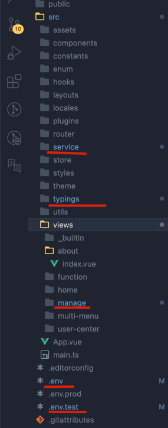

# 豌豆

## 简介

  项目采用SpringBoot3.3 +
JDK21、MyBatis-Plus、SpringSecurity安全框架等，适配 [soybean-admin](https://gitee.com/honghuangdc/soybean-admin)
开发的简单权限系统。

## **技术选型：**

| 依赖           | 版本     |
|--------------|--------|
| Spring Boot  | 3.3.0  |
| JDK          | 21     |
| Mybatis-Plus | 3.5.8  |
| hutool       | 5.8.25 |
| knife4j      | 4.5.0  |
| jwt          | 0.9.1  |
| mysql        | 8.0.33 |
| ...          | ...    |

## TODO 不固定更新

- [x] 优化补充菜单
- [x] 优化日志管理
- [ ] 开发实现Google二次认证
- [ ] 实现按钮权限逻辑

## 后端部署

> - **GitHub仓库地址:** https://github.com/haitang1894/pea.git

- idea、eclipse需安装lombok插件，不然会提示找不到entity的get set方法
- 创建数据库pea，数据库编码为UTF-8
- 执行doc/sql/pea.sql文件，初始化数据
- 修改application-local.yml，更新MySQL账号和密码
- Eclipse、IDEA运行PeaApplication.java，则可启动项目
- Swagger注解路径：http://localhost:9528/doc.html

## 前端部署

> - **GitHub仓库地址:**  https://github.com/soybeanjs/soybean-admin.git

- 前端部署以及更换访问路径请看下面文档

- 前端部署方案：请参考 **[soybean-admin](https://docs.soybeanjs.cn/zh/)** 项目文档

- 前端部署完毕，修改配置就可以使用该后端

- 账号：Soybean，密码：123456

- 账号：admin，密码：123456

（弃用）考虑到soybeanjs作者前端暂时没有对接后端，为了方便新手拉取代码后再添加接口,在本项目web目录整理了需要调整的前端代码
,找到位置直接覆盖即可,随后启动前端、后端就可以正常使用。下图是前端修改位置

## 注解

- 日志记录注解 @SysLogInterface
- 权限认证注解 @PreAuthorize("@pre.hasPermission('system:user:add')")
  目前 权限认证注解 开发并不完善,考虑前端暂未实现权限校验,没有进一步开发

## 6月1日更修内容:

1. 修改 添加/修改时候 创建人 创建人ID 不能获取问题
2. 更新sql修改 admin账号 密码变成 123456
  > update t_sys_user set `password` = '$2a$10$qbdPPGSnLm2oQwgLXyX8wOTgVZLHnm2pqS.We5.n6do3YfVxobCUy' where user_name = 'admin';
3. 添加用户管理、角色管理、菜单管理的添加/修改接口